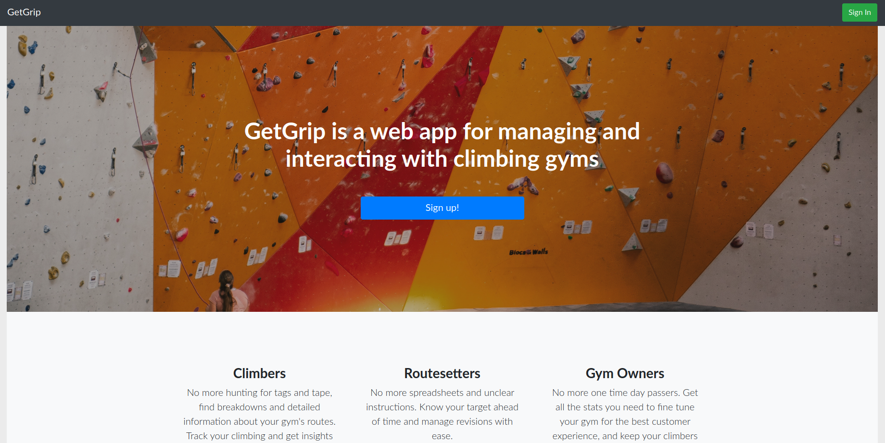

# Get Grip - Live version: [GetGrip](https://getgriprocks.herokuapp.com)
> GetGrip is a web app for managing and interacting with climbing gyms.

Know what you've climbed, and what you should be climbing! GetGrip optimizes your gym time and gives you useful metrics on your performance. Don't worry about adapting your climbing gym's grades, hold colors, or any existing standards to our platform. GetGrip will meet your gym wherever it's at.

## Usage example

No more hunting for tags and tape, find breakdowns and detailed information about your gym's routes. Track your climbing and get insights into your training.

No more spreadsheets and unclear instructions. Know your target ahead of time and manage revisions with ease.

No more one time day passers. Get all the stats you need to fine tune your gym for the best customer experience, and keep your climbers hooked.

## Meta

Jonathan Evans – Jonathan.ca.evans@gmail.com

[https://github.com/jonathancaevans/](https://github.com/jonathancaevans/)

<!-- Markdown link & img dfn's -->
[npm-image]: https://img.shields.io/npm/v/datadog-metrics.svg?style=flat-square
[npm-url]: https://npmjs.org/package/datadog-metrics
[npm-downloads]: https://img.shields.io/npm/dm/datadog-metrics.svg?style=flat-square
[travis-image]: https://img.shields.io/travis/dbader/node-datadog-metrics/master.svg?style=flat-square
[travis-url]: https://travis-ci.org/dbader/node-datadog-metrics
